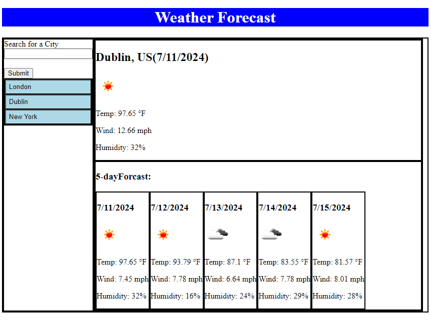

# Challenge-6-Weather-Dashboard-JacquelineObeidzinski
This is Jaci Obeidzinski's Challenge for Module 6. The landing page will have a button an input text box and a search button as well as any previously searched cities as button below on the left side. and will have blank black boxes on the right that will eventually be filled with the weather information whenever a cities name is searched.

## How it's Made:
Tech used: HTML, CSS, jQuery,  and JavaScript

## Lesson Learned
During this activity Jaci learned how use jQuerry and JavaScript to fill in a URL for an image using information from an API and placing that into a partial URL.

## Special Thanks
Thank you to everyone in my class for participating in class allowing me to learn more. 
Thank you to my instructor Chris and the Teaching Assistant Steven. 
## Screen Shot

Here is the link to the deployed website
https://github.com/JaciObeid/Challenge-6-Weather-Dashboard-JacquelineObeidzinski

